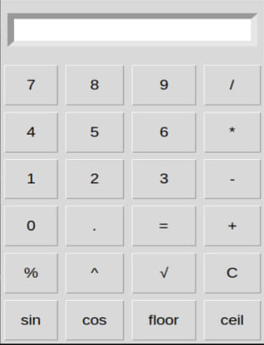

# Calculator App

Scientific Calculator with GUI built in Python using Tkinter

  

## Features

- **Basic arithmetic**: `+`, `-`, `*`, `/`
- **Advanced operations**: `%`, `^`, `√`, `sin`, `cos`
- **Floor and Ceil**
- **Graphical User Interface (GUI)**
- **Cross-platform** (Windows, macOS, Linux)

## Installation
From source
```bash
git clone https://github.com/carielflore/calculator.git
cd calculator
pip install -e .
```

## Usage
Launch GUI
```bash
calculator-gui
```
